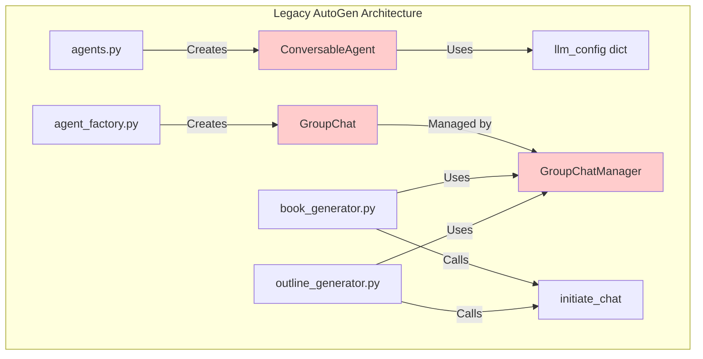
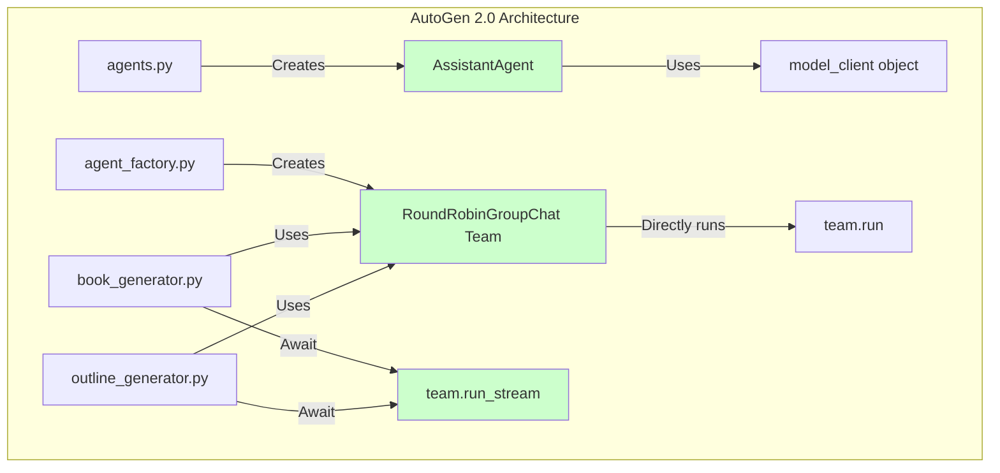
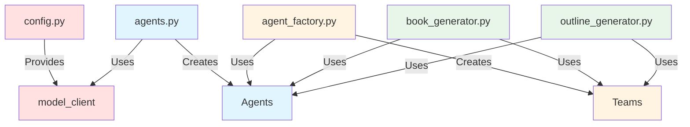
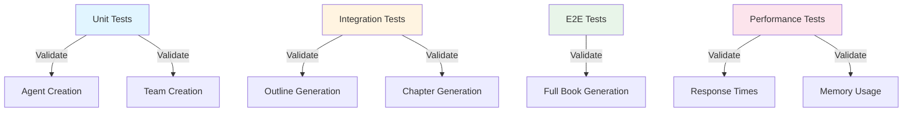
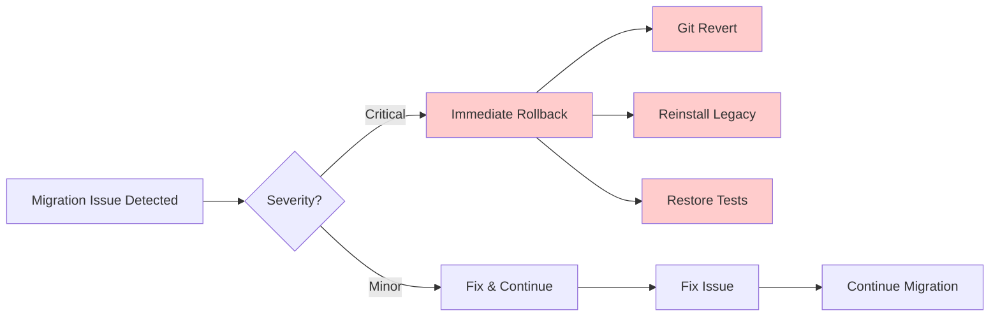

# AutoGen Migration Architecture Diagram

## Current Architecture (Legacy API)

## Target Architecture (AutoGen 2.0)

## Migration Flow

```mermaid
graph LR
    A[Phase 1: Config] --> B[Phase 2: Agents]
    B --> C[Phase 3: Factory]
    C --> D[Phase 4: Book Generator]
    D --> E[Phase 5: Outline Generator]
    E --> F[Phase 6: Testing]
    F --> G[Phase 7: Documentation]
    
    style A fill:#e1f5ff
    style B fill:#e1f5ff
    style C fill:#fff4e1
    style D fill:#fff4e1
    style E fill:#fff4e1
    style F fill:#e8f5e9
    style G fill:#e8f5e9
```

## Key Component Mappings

| Legacy Component | New Component | Notes |
|-----------------|---------------|-------|
| `ConversableAgent` | `AssistantAgent` | Different initialization |
| `llm_config` dict | `model_client` object | More explicit configuration |
| `GroupChat` | `RoundRobinGroupChat` | Team-based approach |
| `GroupChatManager` | `team.run()` | Direct execution, no manager |
| `initiate_chat()` | `await team.run()` | Async by default |
| `messages` list | `result.messages` | Different message object type |
| `speaker_selection_method` | Team type | Built into team selection |

## File Dependency Graph

## Migration Risk Assessment

| Risk | Impact | Mitigation |
|------|--------|------------|
| Async conversion complexity | High | Incremental async migration, wrappers |
| Message format changes | Medium | Adapter layer for message conversion |
| Breaking changes in team API | High | Thorough testing at each phase |
| Performance differences | Medium | Benchmark before/after |
| Documentation gaps | Low | Document as we migrate |

## Testing Strategy

## Rollback Strategy

