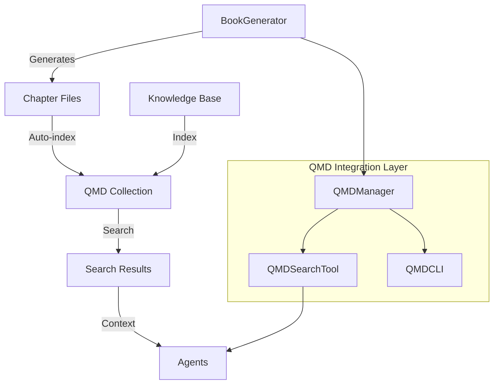

# QMD Integration Design Document

## Overview
Integrate [QMD](https://github.com/tobi/qmd) (Query Markup Documents) into the AutoGen Book Generator to provide:
1. **Chapter Continuity** - Search previous chapters for plot points, character details
2. **Knowledge Base** - Index reference materials and world-building documents
3. **Agent Search Tools** - Allow agents to query book content dynamically

## Architecture



## Components

### 1. QMDManager (`qmd_integration.py`)
Central manager for all QMD operations:
- Initialize QMD collections
- Index chapters after generation
- Search previous chapters
- Manage knowledge base collections

### 2. QMDCLI Wrapper
Python wrapper around QMD CLI commands:
- `qmd collection add` - Add directories to collections
- `qmd embed` - Generate embeddings
- `qmd search` - Keyword search
- `qmd vsearch` - Vector semantic search
- `qmd query` - Hybrid search with reranking

### 3. Search Tools for Agents
Functions agents can use:
- `search_chapters(query)` - Search previous chapters
- `get_character_info(name)` - Find character details
- `get_plot_points(chapter_range)` - Find plot events
- `search_knowledge_base(query)` - Search reference materials

### 4. Auto-Indexing
- Automatically index each chapter after generation
- Maintain collection of all chapters
- Update embeddings incrementally

### 5. Configuration
New `.env` options:
```bash
# QMD Integration
QMD_ENABLED=true
QMD_COLLECTION_NAME=book_chapters
QMD_KB_COLLECTION=knowledge_base
QMD_AUTO_INDEX=true
QMD_INDEX_DRAFTS=false  # Index intermediate drafts too
```

## Implementation Plan

### Phase 1: Core QMD Module
1. Create `qmd_integration.py` with QMDCLI class
2. Implement collection management
3. Add search methods
4. Error handling for missing QMD installation

### Phase 2: BookGenerator Integration
1. Add QMDManager to BookGenerator
2. Auto-index chapters after generation
3. Add search context to agent prompts
4. Resume support for indexing

### Phase 3: Agent Tools
1. Create search functions
2. Add to agent system messages
3. Provide usage examples

### Phase 4: Testing & Quality
1. Unit tests for QMD wrapper
2. Integration tests
3. Ruff linting
4. Error handling tests

## Usage Examples

### Basic Chapter Search
```python
from qmd_integration import QMDManager

qmd = QMDManager("book_output")
results = qmd.search_chapters("What happened to the main character?")
```

### Agent Usage
```
Memory Keeper: I need to check if this character appeared before.
[Uses qmd_search tool]
Found: Character "Alice" first appeared in Chapter 3, described as...
```

### Knowledge Base
```bash
# Index reference materials
qmd collection add ./research --name book_research
qmd embed

# Now agents can search research materials
```

## Benefits

1. **Continuity** - Agents can verify plot points, character descriptions
2. **Consistency** - Ensure world-building rules are followed
3. **Research** - Reference external materials during writing
4. **Debugging** - Search conversation logs for issues

## Fallback Behavior

If QMD is not installed:
- Log warning but continue without indexing
- Agents work without search tools
- Book generation proceeds normally

If QMD commands fail:
- Retry with exponential backoff
- Log errors but don't block generation
- Continue with reduced functionality